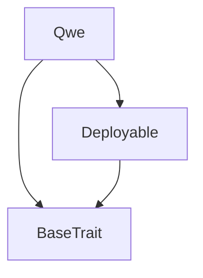
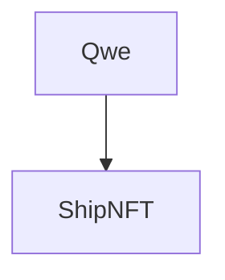

# TACT Compilation Report
Contract: Qwe
BOC Size: 2115 bytes

# Types
Total Types: 27

## StateInit
TLB: `_ code:^cell data:^cell = StateInit`
Signature: `StateInit{code:^cell,data:^cell}`

## Context
TLB: `_ bounced:bool sender:address value:int257 raw:^slice = Context`
Signature: `Context{bounced:bool,sender:address,value:int257,raw:^slice}`

## SendParameters
TLB: `_ bounce:bool to:address value:int257 mode:int257 body:Maybe ^cell code:Maybe ^cell data:Maybe ^cell = SendParameters`
Signature: `SendParameters{bounce:bool,to:address,value:int257,mode:int257,body:Maybe ^cell,code:Maybe ^cell,data:Maybe ^cell}`

## Deploy
TLB: `deploy#946a98b6 queryId:uint64 = Deploy`
Signature: `Deploy{queryId:uint64}`

## DeployOk
TLB: `deploy_ok#aff90f57 queryId:uint64 = DeployOk`
Signature: `DeployOk{queryId:uint64}`

## FactoryDeploy
TLB: `factory_deploy#6d0ff13b queryId:uint64 cashback:address = FactoryDeploy`
Signature: `FactoryDeploy{queryId:uint64,cashback:address}`

## MintShipNFT
TLB: `mint_ship_nft#c72bea97 new_owner:address content:^cell = MintShipNFT`
Signature: `MintShipNFT{new_owner:address,content:^cell}`

## OwnershipAssigned
TLB: `_ query_id:int257 prev_owner:address = OwnershipAssigned`
Signature: `OwnershipAssigned{query_id:int257,prev_owner:address}`

## WithdrawFunds
TLB: `withdraw_funds#7a3247bf query_id:int257 = WithdrawFunds`
Signature: `WithdrawFunds{query_id:int257}`

## WithdrawalConfirmation
TLB: `_ query_id:int257 amount:int257 = WithdrawalConfirmation`
Signature: `WithdrawalConfirmation{query_id:int257,amount:int257}`

## VerifySingle
TLB: `verify_single#5fd60989 ship_level:int257 signature:^slice = VerifySingle`
Signature: `VerifySingle{ship_level:int257,signature:^slice}`

## UpdatePublicKey
TLB: `update_public_key#694e9722 query_id:int257 new_public_key:int257 = UpdatePublicKey`
Signature: `UpdatePublicKey{query_id:int257,new_public_key:int257}`

## ChangeOwner
TLB: `change_owner#d9ae38fe new_owner:address = ChangeOwner`
Signature: `ChangeOwner{new_owner:address}`

## ChangeNFTContent
TLB: `change_nft_content#1091f31e new_nft_content:^cell = ChangeNFTContent`
Signature: `ChangeNFTContent{new_nft_content:^cell}`

## LogEventShipAssembled
TLB: `log_event_ship_assembled#668ce31d user:address nft_received:^cell = LogEventShipAssembled`
Signature: `LogEventShipAssembled{user:address,nft_received:^cell}`

## GetNftCount
TLB: `get_nft_count#dd3f796c query_id:uint64 user:address = GetNftCount`
Signature: `GetNftCount{query_id:uint64,user:address}`

## AssembleShipMessage
TLB: `assemble_ship_message#77159c12 nft_contract_1:address nft_contract_2:address nft_contract_3:address nft_contract_4:address nft_contract_5:address nft_contract_6:address ship_level:int257 signature:^slice = AssembleShipMessage`
Signature: `AssembleShipMessage{nft_contract_1:address,nft_contract_2:address,nft_contract_3:address,nft_contract_4:address,nft_contract_5:address,nft_contract_6:address,ship_level:int257,signature:^slice}`

## UpgradeShip
TLB: `upgrade_ship#2adfccbd nft_contract_1:address nft_contract_2:address nft_contract_3:address nft_contract_4:address nft_contract_5:address nft_contract_6:address nft_contract_7:address ship_level:int257 signature:^slice = UpgradeShip`
Signature: `UpgradeShip{nft_contract_1:address,nft_contract_2:address,nft_contract_3:address,nft_contract_4:address,nft_contract_5:address,nft_contract_6:address,nft_contract_7:address,ship_level:int257,signature:^slice}`

## MintNFT
TLB: `mint_nft#170e4dfd ship_level:int257 = MintNFT`
Signature: `MintNFT{ship_level:int257}`

## ReportNftCount
TLB: `report_nft_count#439ad890 query_id:uint64 user:address nft_count:int257 = ReportNftCount`
Signature: `ReportNftCount{query_id:uint64,user:address,nft_count:int257}`

## Transfer
TLB: `transfer#5b3c1613 new_owner:address forward_amount:uint64 query_id:uint64 = Transfer`
Signature: `Transfer{new_owner:address,forward_amount:uint64,query_id:uint64}`

## BurnNFT
TLB: `burn_nft#a23f2d5a  = BurnNFT`
Signature: `BurnNFT{}`

## BurnSingle
TLB: `burn_single#b9d9cd87 nft_contract:address = BurnSingle`
Signature: `BurnSingle{nft_contract:address}`

## RequestNftCount
TLB: `request_nft_count#739b7a46 user:address nft_count:uint64 = RequestNftCount`
Signature: `RequestNftCount{user:address,nft_count:uint64}`

## GetNftData
TLB: `_ is_initialized:bool index:int257 collection_address:address owner_address:address individual_content:^cell = GetNftData`
Signature: `GetNftData{is_initialized:bool,index:int257,collection_address:address,owner_address:address,individual_content:^cell}`

## Qwe$Data
TLB: `null`
Signature: `null`

## ShipNFT$Data
TLB: `null`
Signature: `null`

# Get Methods
Total Get Methods: 2

## getNewNftItemInit
Argument: item_index

## getOwner

# Error Codes
2: Stack underflow
3: Stack overflow
4: Integer overflow
5: Integer out of expected range
6: Invalid opcode
7: Type check error
8: Cell overflow
9: Cell underflow
10: Dictionary error
13: Out of gas error
32: Method ID not found
34: Action is invalid or not supported
37: Not enough TON
38: Not enough extra-currencies
128: Null reference exception
129: Invalid serialization prefix
130: Invalid incoming message
131: Constraints error
132: Access denied
133: Contract stopped
134: Invalid argument
135: Code of a contract was not found
136: Invalid address
137: Masterchain support is not enabled for this contract
14534: Not owner
23386: Not from collection
47429: Only the owner can update the public key
48401: Invalid signature
53983: Price requirement is not met
54727: Not the owner
58821: No funds available for withdrawal
63433: Only the owner can withdraw funds

# Trait Inheritance Diagram

# Contract Dependency Diagram

